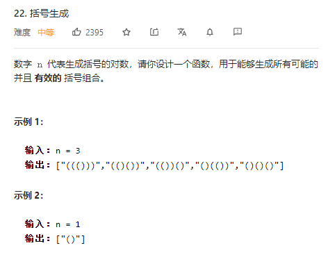
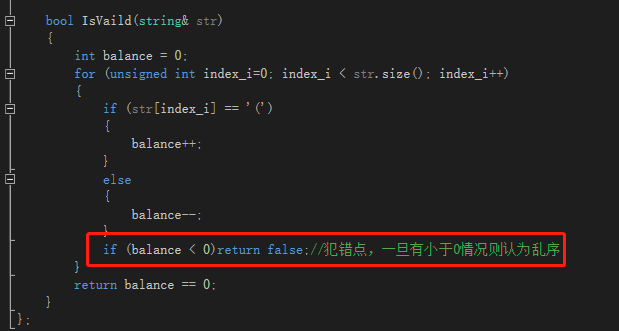
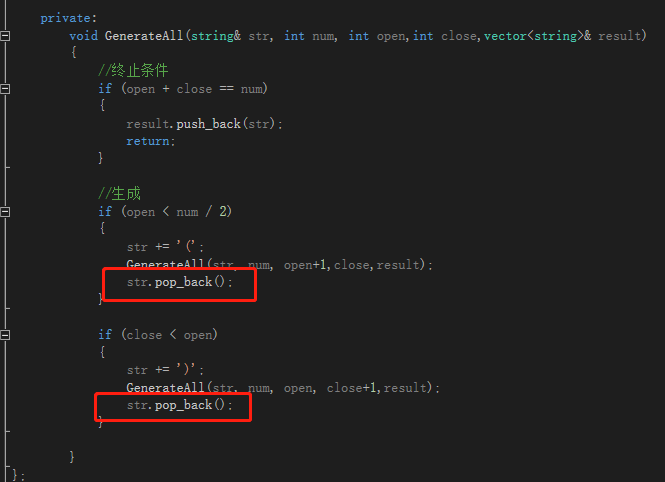

# 笔记
- 题干
  - 
- 方法
  - DFS
    - 实现
      - 利用递归实现各种可能性，递归到叶子节点都结束
      - 对叶子节点进行有效性分析
    - 细节
      - 有效性分析，balance一旦出现负数则可以认为是无效，破坏了“（）”的规律
      - 
  - DFS + 剪枝
    - 实现
      - 剪枝：在DFS基础上，控制左括号少于等于对数，右括号小于等于左括号
      - DFS结束：左括号+有括号数量等于num
    - 细节
      - 由于共用一个string来实现，所以回退节点时需要pop_back，类似于回退
      - 